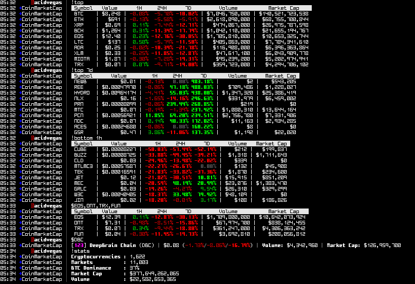

###### Requirments
* [Python](https://www.python.org/downloads/) *(**Note:** This script was developed to be used with the latest version of Python.)*
* [PySocks](https://pypi.python.org/pypi/PySocks) *(**Optional:** For using the `proxy` setting.)*

###### Screenshots

###### Information
The API only updates it's data every 5 minutes so the bot will cache the data returned from the API for faster replies to commands. After 5 minutes has passed since the last cache has been stored, it will update the cache on the next query command.

###### Commands
| Command | Description |
| --- | --- |
| @cmc | Information about the bot. |
| $\<name> | Return information for the \<name> cryptocurrency. *(\<name> can be a comma seperated list)* |
| !seach \<query> | Search the market for \<query>. |
| !stats | Global market statistics. |
| !top [\<1h/24h/7d/value/volume>] | Return information for the top 10 cryptocurrencies based on market cap or [\<1h/24h/7d/value/volume>]. |
| !bottom [\<1h/24h/7d/value>] | Return information for the bottom 10 cryptocurrencies based on [\<1h/24h/7d/value>]. |

###### Mirrors
- [acid.vegas](https://acid.vegas/cmc) *(main)*
- [SuperNETs](https://git.supernets.org/pumpcoin/cmc)
- [GitHub](https://github.com/pumpcoin/cmc)
- [GitLab](https://gitlab.com/pumpcoin/cmc)